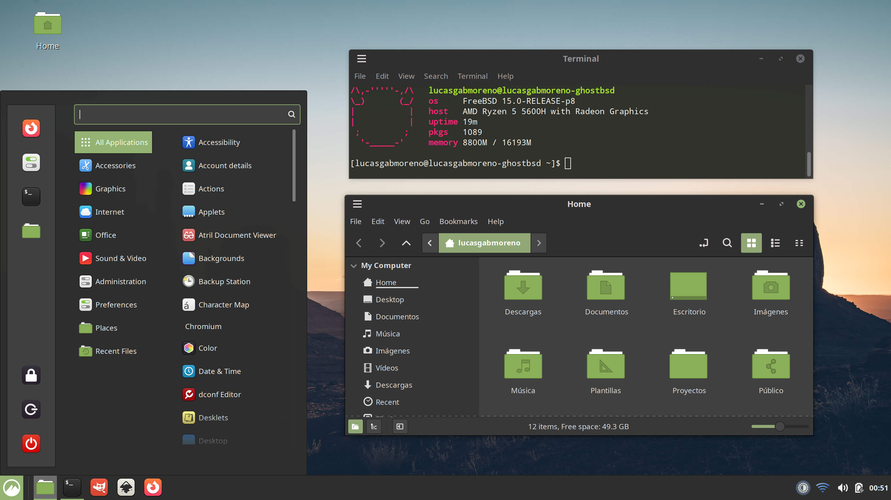

> [!WARNING]  
> Work in progress


### Mint



This is a backup of the styles installed by default in [LMDE7](https://linuxmint.com/download_lmde.php)
 
## Install
```
curl -sL https://raw.githubusercontent.com/lucasgabmoreno/cinnamon-styles-themes/refs/heads/main/cinnamon-styles-themes.sh | sudo sh -s -- mint
```
## Uninstall
```
curl -sSL https://raw.githubusercontent.com/lucasgabmoreno/cinnamon-styles-themes/main/styles/mint/uninstall.sh | /bin/sh
```

## Includes

* Themes:
  * Adwaita*
  * Default
  * Emacs
  * HighContrast
  * Mint-L*
  * Mint-X*
  * Mint-Y*
* Cursors:
  * Bibata*
  * DMZ*
  * GoogleDot*
  * XCursor-Pro-*
* Icons:
  * Adwaita
  * default
  * hicolor
  * HighContrast
  * locolor
  * Mint-L*
  * Mint-X*
  * Mint-Y*
  * Papirus*
  * ubuntu-mono-*

## Resources
* [LMDE7](https://linuxmint.com/download_lmde.php)

